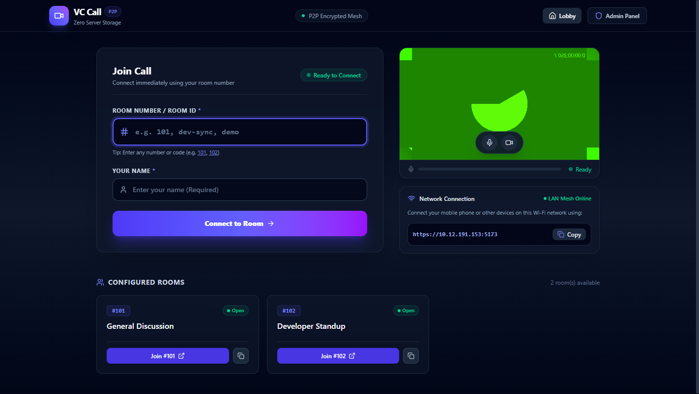
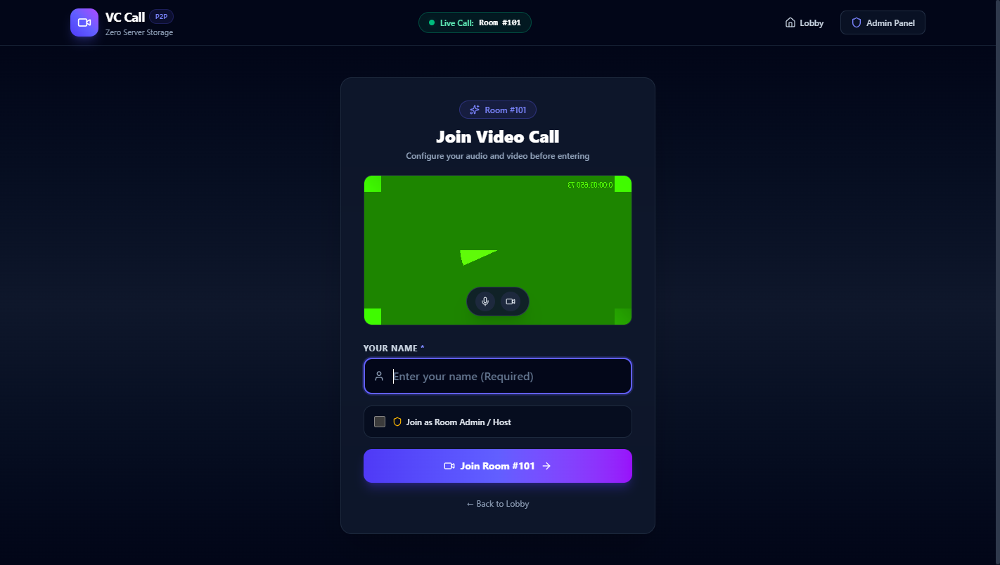
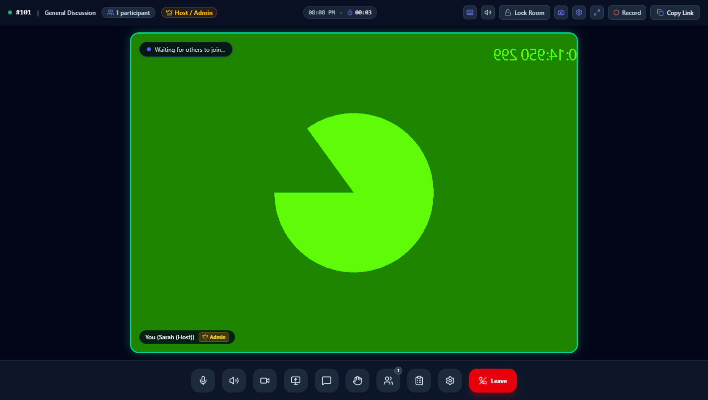
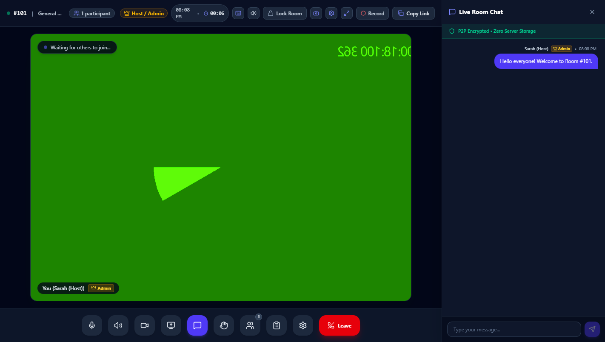
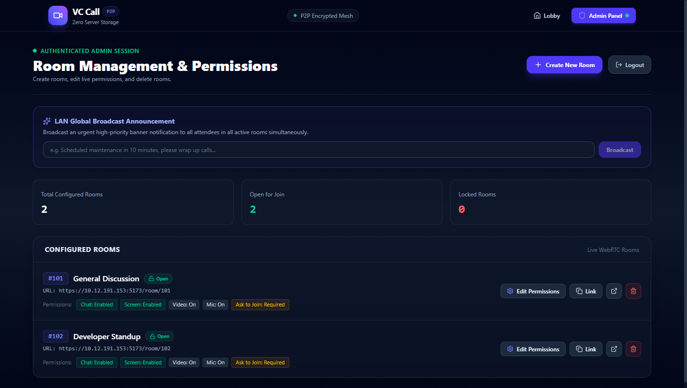

# 📹 VCCall — Secure Local Network (LAN) Video Conferencing

A modern, professional **Peer-to-Peer (P2P) Video Conferencing & Real-Time Collaboration** web application tailored for **Local Area Networks (LAN)**. Built with **React 19**, **Vite**, **Tailwind CSS**, and **WebRTC (PeerJS)** with **zero server storage**.

---

## 📸 Product Screenshots & Visual Walkthrough

| **Lobby & Room Selection** | **Pre-Join Audio/Video Preview** |
|:---:|:---:|
|  |  |
| *Discover LAN rooms, test camera/mic, and copy network invite links.* | *Verify camera, microphone, and choose whether to join as Host.* |

| **Active Video Call Room** | **In-Call Chat & Real-Time Collaboration** |
|:---:|:---:|
|  |  |
| *Active speaker ring, floating controls dock, recording, and room lock.* | *P2P encrypted text messaging, emoji reactions, and shared agenda notes.* |

### 🛡️ Admin Dashboard & Live Management

*Manage rooms, toggle live permissions (camera/mic/screen/chat), lock rooms, and send global network announcements.*

---

## 🌐 Why Local Network (LAN) Video Calling?

Most video conferencing tools (Zoom, Google Meet, Microsoft Teams) route all audio, video, and screen data through external cloud servers across the public internet. This causes major drawbacks in localized environments:

1. **Zero External Internet Consumption**: 
   Video and audio streams flow strictly across your local Wi-Fi or Ethernet switch. Multiple high-definition streams won't congest your office or home internet connection.
2. **Ultra-Low Latency & High Fidelity**:
   Packets stay within your local subnet, delivering sub-millisecond network hops, minimal lag, and crisp HD video and clear audio.
3. **100% Private, Secure & Ephemeral**:
   Streams are encrypted peer-to-peer using **DTLS-SRTP**. Media and chat messages never touch a third-party server or cloud database. What happens in the room stays strictly between the participants.
4. **Works in Air-Gapped & Offline Environments**:
   Perfect for corporate intranets, hospitals, universities, secure research facilities, disaster relief sites, construction trailers, cruise ships, or remote field offices where internet connectivity is restricted, expensive, or entirely offline.

---

## ✨ Features & Capabilities

### 🎥 Video, Audio & Grid Experience
- **Direct P2P Full-Mesh Video**: Connects browsers directly with automated WebRTC negotiation—no media server in the middle.
- **Active Speaker Highlighting**: Audio analysers monitor who is speaking in real time and illuminate their tile with a distinct ring.
- **Spotlight & Pin Tile Mode**: Double-click any participant or screen share (or press `P`) to enlarge their video into center stage.
- **Floating Picture-in-Picture (PiP)**: Keep an eye on active discussion while switching tabs or checking documents.
- **Low Bandwidth Mode**: One-tap toggle that caps outbound video bitrate and frame rate to keep audio clear on congested Wi-Fi.
- **Gentle Synthesized Audio Alerts**: Custom Web Audio tones signal joins, leaves, knocks, admitted status, chat messages, and raised hands without loading external MP3 files.

### 🚪 Waiting Room & Host Moderation ("Knock to Enter")
- **Knock Queue**: When a room has approval enabled, guests wait in a clean holding screen while the host reviews their request.
- **Instant Admit or Deny**: Room hosts receive an interactive banner to admit or deny pending guests on the fly.
- **Auto-Deny Safeguard**: Knock requests automatically expire after 2 minutes so unattended requests don't linger.
- **Live Room Locking**: Admins can lock an active room at any moment to reject all new joiners.
- **Host Moderation Tools**:
  - Remote mute participants.
  - Revoke or grant screen-sharing permissions on a per-user basis.
  - Remove / kick participants from the active call.

### 💬 In-Call Collaboration & Interaction
- **Encrypted In-Call Chat**: Peer-to-peer text messaging over WebRTC data channels with unread badge indicators.
- **Emoji Message Reactions**: React to chat messages with quick emoji reactions.
- **Pin Important Messages**: Pin crucial links or notes to the top of the chat panel.
- **Shared Meeting Agenda & Live Notes**: A collaborative agenda panel synced across all participants in real time.
- **Hand Raising (✋)**: Participants can raise their virtual hand to request a speaking turn; hosts can lower hands as needed.
- **Meeting Snapshot Camera**: Capture a composite screenshot of all participants in one click with room timestamp watermark.

### 📊 Meeting Intelligence, Attendance & Local Recording
- **100% Client-Side Recording**: Record audio and video locally directly to `.webm` using the browser's MediaRecorder API—zero cloud infrastructure or subscription required.
- **Real-Time Attendance Tracker**: Automatically records join times, exit times, and roles for every participant.
- **Download Meeting Summary**: Export a clean `.txt` summary containing meeting duration, full attendance log, agenda notes, and the chat transcript.
- **WebRTC Network Inspector**: Real-time diagnostic modal showing Round-Trip Time (RTT), packet loss, resolution, framerate (FPS), and live bitrate per peer.

### 🛡️ Admin Dashboard (`/admin`)
- **Centralized Room Management**: Create and configure custom rooms (e.g., Room `101`, `Team Standup`, `Executive Board`).
- **Granular Permission Toggles**:
  - Enable or disable Cameras globally.
  - Enable or disable Microphones globally.
  - Allow or restrict Screen Sharing.
  - Allow or restrict In-Call Chat.
  - Require Host Knock Approval (*"Ask Before Join"*).
- **Global Broadcast Announcements**: Push high-priority flash announcements to every active room across the entire LAN.
- **Live Room Presence Counter**: View active participant counts across all rooms in real time.
- **One-Click Session Teardown**: Deleting a room gracefully disconnects all connected peers and returns them to the lobby.

### 📱 Thoughtful Mobile & Cross-Device UX
- **Dynamic Viewport (`100dvh`)**: Prevents the mobile browser address bar from cutting off controls on iOS Safari and Android Chrome.
- **Thumb-Friendly Touch Dock**: Floating bottom control dock designed for natural one-handed mobile navigation.
- **Smart Camera/Mic Fallbacks**: If hardware permissions are blocked or locked by another app, the app falls back to audio-only or a synthetic avatar so you never get stuck.
- **Built-in Self-Signed HTTPS**: Seamless camera and microphone capture on mobile devices over local IP addresses without browser security blocks.

---

## ⌨️ Built-in Keyboard Shortcuts

Work faster during active meetings using single-key shortcuts:

| Key | Action |
|:---:|:---|
| **M** | Toggle Microphone (Mute / Unmute) |
| **V** | Toggle Camera (Video On / Off) |
| **O** | Mute Output Audio (Deafen) |
| **C** | Open / Close Chat Drawer |
| **P** | Open / Close Participants Panel |
| **H** | Raise or Lower Hand (✋) |
| **S** | Take Meeting Snapshot |
| **F** | Toggle Fullscreen Mode |
| **?** | Open Keyboard Shortcuts Cheat Sheet |
| **Esc** | Close Active Modals / Drawers / Unpin Tile |

---

## 🛠️ Tech Stack

- **Frontend**: [React 19](https://react.dev/), [Vite](https://vitejs.dev/)
- **Styling**: [Tailwind CSS](https://tailwindcss.com/), [Lucide React Icons](https://lucide.dev/)
- **Real-Time Communication**: [WebRTC](https://webrtc.org/), [PeerJS](https://peerjs.com/)
- **Local Signaling**: Built-in Vite WebSocket signaling for mesh coordination & knock notifications
- **SSL / Security**: `@vitejs/plugin-basic-ssl` for self-signed HTTPS on local network IPs

---

## 🚀 Quick Start & Installation

### 1. Prerequisites
- **Node.js** (v18.0.0 or higher recommended)
- **npm** (comes bundled with Node.js)

### 2. Clone the Repository
```bash
git clone https://github.com/your-username/vccall.git
cd vccall
```

### 3. Install Dependencies
```bash
npm install
```

### 4. Configure Environment Variables (`.env`)
Create or edit the `.env` file in the root directory:

```env
# Admin Panel & Host Password
VITE_ADMIN_PASSWORD=admin123

# Your machine's Local Network IP (e.g., 192.168.1.X or 10.X.X.X)
VITE_APP_IP=10.12.191.153
```

> **How to find your local IP**:
> - **Windows**: Open PowerShell or CMD and run `ipconfig` (look for *IPv4 Address* under your Wi-Fi or Ethernet adapter).
> - **macOS / Linux**: Run `ifconfig` or `ip a` (look for `inet` under `en0`, `wlan0`, or `eth0`).

---

## 🏃 Running the Application

### Start the Local HTTPS Server
```bash
npm run dev -- --host
```

Vite will start the server and bind to all network interfaces:
```
  ➜  Local:   https://localhost:5173/
  ➜  Network: https://10.12.191.153:5173/
```

### Connecting from Mobile Devices / Other Laptops
1. Connect your phone or second device to the **same Wi-Fi network**.
2. Open your mobile browser (Safari on iOS, Chrome on Android).
3. Navigate to the Network URL shown on your screen (e.g., `https://10.12.191.153:5173`).
4. **Bypass the Self-Signed Certificate Warning**:
   - Because the app runs locally with a development SSL certificate, the browser will show a standard warning:
     - **Chrome / Android**: Tap **Advanced** ➜ **Proceed to 10.12.191.153 (unsafe)**.
     - **Safari / iOS**: Tap **Show Details** ➜ **visit this website** ➜ confirm **Visit Website**.
5. Allow camera and microphone permissions when prompted.

---

## 📖 How to Use

### 1. Joining a Video Call as a Participant
1. Open the home page (`https://<your-ip>:5173/`).
2. Enter any configured Room Number (e.g. `101`, `102`) and click **Connect to Room**.
3. In the pre-join preview, enter your display name and check your camera/mic.
4. Click **Join Room**. If the host has enabled *"Ask Before Join"*, you will wait until the host admits you.

### 2. Joining as Room Host / Admin
1. Go to the room URL (e.g. `https://<your-ip>:5173/room/101`).
2. Check the **"Join as Room Admin / Host"** checkbox.
3. Enter your admin password (configured in `.env`).
4. You will join with the 👑 **Host / Admin** badge and will be able to review and admit pending guest requests.

### 3. Managing Rooms in the Admin Panel (`/admin`)
1. Navigate to `https://<your-ip>:5173/admin`.
2. Enter the admin password.
3. **Create Rooms**: Specify a room number, friendly name, and default permissions.
4. **Edit Permissions Live**: Instantly toggle Chat, Screen Sharing, Video, Audio, or Lock the room.
5. **Delete Rooms**: Terminate the session and automatically eject all connected peers back to the lobby.

---

## 📦 Building for Production

To create an optimized production build:

```bash
npm run build
```

Preview the production build locally:
```bash
npm run preview -- --host
```

---

## 🔒 Security & Privacy Notice

- **No Data Collection**: No cookies, tracking scripts, or analytics are included.
- **Local Network Isolation**: No media or signaling traffic leaves your local area network unless you explicitly configure an external STUN/TURN server.
- **Encrypted WebRTC**: Audio, video, and data channels are encrypted end-to-end via WebRTC standards (DTLS/SRTP).

---

## 📄 License

This project is licensed under the [MIT License](LICENSE). Feel free to use, modify, and distribute it for private, organizational, or commercial use.
